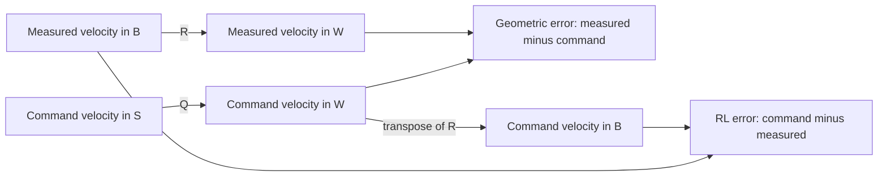

# Frames and coordinates: the room, the drone, and the command

This guide explains the frame convention for the navigator, geometric controller,
and SAC controller. It includes the minimal implementation changes at the end.

**Status:** the navigator and both controllers use the reference-frame command
convention described here. The frame name and zero-angular-rate contract are
explicit. No tests, verification commands, or simulation were run for this
implementation, as requested.

## 1. Imagine a toy drone in a room

Draw three arrows on the floor: one toward the door, one toward the window, and
one pointing up. These arrows belong to the **room**. They stay put when the drone
turns.

Now stick three arrows on the drone: forward, left, and out through its top.
These arrows belong to the **drone**. They turn and tilt with it.

Suppose the drone moves toward the door. Someone standing in the room might say
“move along the room's first arrow.” Someone sitting on the drone might say
“move to my left.” They can describe the same movement with different numbers.

A **frame** is an origin and a set of arrows. **Coordinates** are the numbers we
use to describe something using those arrows. Changing coordinates changes the
description, not the physical movement.

Our navigation command also has an imaginary set of arrows. Picture a small,
level toy drone drawn at the target. Those are the **reference arrows**. They
help us write down a command; the real drone does not have to share their tilt.

Finally, the geometric controller chooses how the real drone should lean to
produce the requested push. Those are the **control-attitude arrows**.

The rule to remember: **use the same arrows before subtracting two velocities.**

## 2. The four frames

| Symbol | Meaning | Orientation in world coordinates | Where it appears |
| --- | --- | --- | --- |
| `W` | Fixed simulation world / odometry frame | Identity | `/X3/odom` |
| `B` | Actual drone body, including roll and pitch | `R` | Ground-truth pose; `curr_rot` |
| `S` | Virtual command reference frame | `Q` | Command pose; `reference_rot` |
| `C` | Attitude selected to produce thrust | `R_c` | Result of `compute_desired_orientation`; `control_rot` |

`B` is attached to the actual base-link origin. The simulator currently labels
it `/X3/base_footprint`, but publishes the **full tilted base-link orientation**.
Do not infer a level, ground-projected frame from that name. See
[the ground-truth publisher](../src/sdrl_lionquadcopter/src/lionquadcopter.cpp).

`S` has its virtual origin at the commanded position. Its orientation comes from
the same command message. During takeoff, `Q = I`. During flight, it is level
with the yaw sampled by the navigator when that command is created. It remains
part of that command until the next update.

`C` is principally an orientation used inside the controller. It is calculated
from position error, velocity error, gravity, acceleration limits, and a heading
reference. It is not the frame in which the navigator encoded its velocity.

There is no requirement that `R`, `Q`, and `R_c` be equal.

The plugin copies Gazebo world pose into `/X3/odom` without applying another
world-to-odom transform. This guide uses `W` for that shared coordinate system.
Adding a separate localization or map frame would require an explicit transform.

## 3. Axes, units, and rotations

The body convention is **x forward, y left, z up**, with right-handed rotations.
World z points upward. The simulation's world x/y axes need not represent actual
geographic east/north. Positions use metres, velocities metres/second, angles
radians, angular velocities radians/second, force newtons, and torque
newton-metres. These choices follow [ROS REP 103](https://github.com/ros-infrastructure/rep/blob/master/rep-0103.rst).

Positive yaw turns the forward arrow toward the left arrow when viewed from
above a level drone. Roll, pitch, and yaw describe orientation; body angular
velocity components `p, q, r` are generally **not** their time derivatives.

In the equations below, vectors are columns. A superscript identifies the axes
used to express a vector: `v^W` uses world axes; `v^B` uses actual body axes.

`R` maps body coordinates into world coordinates:

```text
v^W = R v^B
v^B = R^T v^W
```

The columns of `R` are the drone's forward, left, and top arrows, expressed using
world coordinates. For a rotation, `R^T R = I`, so the transpose undoes it.

For the command reference frame:

```text
u^W = Q u^S
u^S = Q^T u^W
u^B = R^T Q u^S
```

The last line says: “reference arrows to room arrows, then room arrows to actual
drone arrows.” Both controllers use this same coordinate relationship.

A useful direction check is a level drone at +90 degrees yaw:

```text
R [1, 0, 0]^T = [0, 1, 0]^T   # body forward is world +y
R^T [1, 0, 0]^T = [0, -1, 0]^T # world +x is body right
```

### Position needs an origin; velocity needs careful meaning

For an absolute point `a`, whose world position is `a^W`, its coordinates relative
to the actual body origin `x^W` are:

```text
a^B = R^T (a^W - x^W)
```

A position error is already a difference of two world positions. Rotate that
difference once; do not subtract another origin.

The measured `v^B` is the velocity of the body origin **relative to the world,
expressed using body axes**. It is not “the body's velocity relative to itself.”
Likewise, `u^S` is a requested world-relative velocity written using reference
axes, not a velocity relative to a moving reference origin.

Here we rotate the components of measured and commanded velocity vectors. We
are not moving a rigid-body velocity measurement from the drone centre to a
camera or rotor. That different operation can require an `angular velocity ×
offset` term.

If differentiating a measured body-coordinate velocity, the rotating axes also
matter:

```text
d(v^B)/dt = R^T d(v^W)/dt - Omega^B × v^B
```

That term is needed for a derivative in rotating coordinates, not for the
instantaneous conversion `v^W = R v^B` used here.

### Quaternions are another way to store the arrows

ROS stores named quaternion fields `x, y, z, w`; see the
[Quaternion message](https://github.com/ros2/common_interfaces/blob/rolling/geometry_msgs/msg/Quaternion.msg).
This project's `quat_to_rotmat`, `quat_to_euler`, and `euler_to_quat` use
**`w, x, y, z` argument/return order**. Access named fields explicitly when
crossing that boundary. Identity is `w=1, x=y=z=0`.

The input contract requires a valid unit quaternion. `quat_to_rotmat` accounts
for a nonzero quaternion's norm, but `quat_to_euler` does not do the same
normalization. A zero quaternion does not represent an orientation.

## 4. What each message means

The [ROS Odometry definition](https://github.com/ros2/common_interfaces/blob/rolling/nav_msgs/msg/Odometry.msg)
places pose in `header.frame_id` and twist components in `child_frame_id`.
The frame name labels coordinates; it does not rotate the numbers automatically.

| Field | Ground truth: `/X3/gt_odom` | Command: `/X3/cmd_odom` |
| --- | --- | --- |
| `header.frame_id` | `/X3/odom` (`W`) | `/X3/odom` (`W`) |
| `child_frame_id` | `/X3/base_footprint` (`B`) | `/X3/command_reference` (`S`) |
| `pose.pose.position` | Actual body-origin position `x^W` | Position setpoint `x_s^W` |
| `pose.pose.orientation` | Actual rotation `R` | Reference rotation `Q` and heading input |
| `twist.twist.linear` | Measured `v^B = R^T v^W` | Velocity setpoint `u^S = Q^T u^W` |
| `twist.twist.angular` | Measured body angular velocity `Omega^B` | Zero only; no angular-rate feedforward |

The command uses `/X3/command_reference`, distinguishing the virtual frame from
the measured body frame. An Odometry publication does not itself publish a TF
transform. These controllers use the quaternion in the message and need no TF
lookup or new TF broadcaster. A future consumer using TF would need an explicit
transform.

### The command is a setpoint bundle, not a complete trajectory

The project reuses Odometry as a command container. Its position and velocity
are independent control setpoints; they are not guaranteed to satisfy
`u^W = d(x_s^W)/dt`.

For example, during takeoff the target position stays at five metres while the
requested upward speed can be positive. The five-metre target is a destination,
not the current point on a time-parameterized reference flight path.

Consequently, the velocity-setpoint error is not generally the derivative of the
position error:

```text
e_x = x - x_s
d(e_x)/dt = v - d(x_s)/dt
e_v = v - u
```

They coincide only when `u = d(x_s)/dt`. The current controller remains a
well-defined feedback law with independent setpoints. It cannot promise to
track two incompatible requests exactly. For instance, a fixed destination and
a constant nonzero speed request cannot both be achieved indefinitely. In
unsaturated ideal steady state, that combination produces a position offset
`x - x_s = (k_v / k_p) u`. During takeoff, the speed request decreases to zero
at the destination, so that particular conflict disappears there.

Similarly, zero command angular velocity means “no angular-rate feedforward.”
It is not a claim that the sampled reference yaw never changes, or that the
computed control attitude `R_c` has zero derivative.

Keep these semantics explicit to preserve the current navigation behavior with
minimal changes. A future physically consistent trajectory interface would need
position, velocity, acceleration, and attitude derivatives that agree with one
another. Standard odometry estimators should not consume this command topic as
if it were measured motion.

## 5. One velocity, two controllers

The navigator first chooses a world velocity `u^W`, then sends:

```text
u^S = Q^T u^W
```

The geometric controller works in world coordinates:

```text
v^W = R v^B
u^W = Q u^S
e_x^W = x^W - x_s^W
e_v^W = v^W - u^W
```

The SAC observation works in actual body coordinates and uses the opposite error
sign, command minus measurement:

```text
delta_x^B = R^T (x_s^W - x^W)
delta_v^B = R^T Q u^S - v^B
```

These conventions agree:

```text
delta_x^B = -R^T e_x^W
delta_v^B = -R^T e_v^W
||delta_v^B|| = ||e_v^W||
```

The norm identity applies before componentwise observation clipping. It means
the unnormalized velocity-distance reward can describe the same physical error
regardless of which axes express it.

The RL observation also contains actual roll, pitch, and body rates. Roll and
pitch are posture features, not the geometric controller's `R_c` attitude error.
Yaw is omitted from the normalized observation; this policy does not implement
arbitrary heading tracking. Keeping that observation design is compatible with
fixing its velocity coordinates.



The arrows describe coordinate conversions, not the direction the drone flies.

### Example: moving correctly while tilted

Let yaw be zero, actual pitch be +15 degrees, and `Q = I`. Both actual and
requested world velocity are `[0.5, 0, 0]` m/s.

```text
u^S = [0.5,      0, 0       ]
v^B = [0.482963, 0, 0.129410]

Incorrect: u^S - v^B       = [0.017037, 0, -0.129410]
Correct:   R^T Q u^S - v^B = [0,        0,  0       ]
```

The positive measured body-z component does not mean the drone is climbing.
The drone's top arrow is tilted, so horizontal movement has a component along
that arrow. Its world vertical velocity is still zero.

## 6. Why a held command must keep its own arrows

The navigator runs at 10 Hz; the geometric controller runs at 100 Hz. A command
can therefore be reused after the actual attitude has changed.

The old convention encoded with the actual attitude at command time `t_k`, then
decoded with the actual attitude at controller time `t`:

```text
old decoded world command = R(t) R(t_k)^T u^W
```

That equals `u^W` only for suitable unchanged orientations or special vectors.
For small attitude changes, the error is approximately a small rotation vector
crossed with the requested world velocity.

The new convention stores the reference quaternion and velocity together:

```text
new decoded world command = Q(t_k) Q(t_k)^T u^W = u^W
```

Changing the actual tilt or yaw does not rotate the held world command. Decode
using the quaternion from the same command, not a newly sampled heading.

For a command `[0, 0, 0.3]` m/s generated while level, a later +15-degree pitch
made the old decoded command approximately `[0.077646, 0, 0.289778]`. With the
current velocity gain of 5, the false x velocity contributes 0.388229 m/s² of
unintended horizontal acceleration demand before saturation.

## 7. How the drone turns a velocity error into motion

**Toy version:** propellers push out through the drone's top. To push sideways,
the drone leans. Writing “move toward the door” using level reference arrows
does not tell the real drone to remain level.

The controller's ideal rigid-body model uses upward world z and positive thrust
along body +z:

```text
dx^W/dt = v^W
m dv^W/dt = f R e3 - m g e3
dR/dt = R hat(Omega^B)
J d(Omega^B)/dt + Omega^B × (J Omega^B) = tau^B
```

Here `e3 = [0, 0, 1]^T`, `f` is total thrust magnitude, `tau^B` is body torque,
`m` is mass, and `J` is body inertia. `hat(a) b = a × b`. This model omits drag,
disturbances, motor lag, and differences between nominal parameters and the
simulated multibody vehicle.

The implementation computes a requested thrust acceleration:

```text
a_raw^W = -k_p e_x^W - k_v e_v^W + g e3
```

`k_p` has units 1/s² and `k_v` has units 1/s. Therefore every term has units m/s².
This command includes gravity compensation: it is not the drone's net physical
acceleration. At ideal level hover it is `[0, 0, g]`, while actual acceleration
is zero.

The code constrains `a_raw^W` to obtain `a_cmd^W`: positive vertical component,
maximum thrust acceleration, and maximum tilt. Then it constructs `R_c`:

```text
b3_c = a_cmd^W / ||a_cmd^W||
h = [cos(psi_s), sin(psi_s), 0]^T
b2_c = normalize(b3_c × h)
b1_c = b2_c × b3_c
R_c = [b1_c, b2_c, b3_c]
```

`psi_s` comes from the command quaternion. `h` is a heading construction input;
the resulting first axis is its projection into the plane normal to `b3_c`.
Do not assume this construction exactly preserves an Euler yaw at every tilt.
The implementation includes numerical handling near degenerate directions.

The thrust command uses the actual thrust direction:

```text
f = clip(m a_cmd^W · (R e3), f_min, f_max)
```

If actual attitude aligns with `R_c` and no further actuator limits intervene,
the thrust realizes `m a_cmd^W`. Before that alignment, the force follows the
actual tilted body axis. Motor mixing and clipping can further limit the
realized wrench. The equations describe requested control, not a guarantee of
instantaneously achievable acceleration.

These formulas map directly to
[compute_wrench and compute_desired_orientation](../src/sdrl_geometric_controller/sdrl_geometric_controller/geometric_controller.py).
The geometric-control reference separates translational tracking from a
computed thrust attitude in the same way, but uses different thrust/gravity
sign conventions. Its full controller also includes trajectory derivatives and
angular feedforward absent here; its stability result cannot simply be assigned
to this implementation. See [Lee, Leok, and McClamroch, equations 17–23](https://arxiv.org/pdf/1003.2005).

## 8. Angular motion: keep the small controller honest

The current navigator always supplies zero command angular velocity. For that
supported case, the existing torque law reduces exactly to:

```text
tau^B = -K_R e_R - K_Omega Omega^B + Omega^B × (J Omega^B)
```

`K_R` and `K_Omega` are diagonal gains; the code implements their products with
elementwise multiplication. This is attitude feedback plus actual-body-rate
damping and gyroscopic compensation. Calling `Omega^B` a damping signal avoids
claiming it is the exact tracking error for a changing `R_c`.

There is a scaling detail worth preserving during the frame fix. For a
skew-symmetric matrix, define `vee(A) = [A32, A13, A21]^T` using one-based indices.
The usual geometric error is:

```text
e_R_standard = 0.5 vee(R_c^T R - R^T R_c)
```

The current `rotation_error()` actually returns:

```text
e_R = vee(R_c^T R - R^T R_c) = 2 e_R_standard
```

Its componentwise `0.5 * (A32 - A23)` already extracts `A32`, since `A` is skew.
This scale can be absorbed into the gain. Document the existing definition and
keep it during the frame correction; changing the scale alone changes the
effective attitude gain. No normalization change is needed for coordinate
consistency.

The previous expression `R^T R_c desired_angular_velocity` would only be a valid
coordinate conversion if that angular velocity were expressed in `C`. Our
command container uses `S`, and its zero angular field is not a computed `C`
trajectory rate. The implementation writes body-rate damping directly. The
navigator supplies zero angular commands, and both controller paths assume
that input contract without adding runtime checks. Nonzero angular commands
are unsupported and ignored; they must not be interpreted as tracked rates.

For a future full attitude-tracking controller, compute:

```text
Omega_c^C = vee(R_c^T dR_c/dt)
e_Omega^B = Omega^B - R^T R_c Omega_c^C
```

Simply rotating a rate supplied in `S` by `R_c` does not calculate this
derivative. Supporting it also requires consistent feedforward and sampling;
it is a separate controller extension.

## 9. Minimal implementation changes

The implementation touches three production Python files and this guide:

1. The navigator retains `u^S = Q^T u^W` and publishes the command with child
   frame `/X3/command_reference`. The local names identify the reference basis.
2. The geometric controller retains `u^W = Q u^S`, measured velocity conversion
   with `R`, and thrust projection onto `R e3`. `reference_rot` and `control_rot`
   distinguish the velocity basis from the thrust attitude.
3. The shared RL error function computes `R.T @ Q @ cmd_linvel_ref - gt_v_b`.
   SAC inference and training both use it. Observation size, ordering,
   normalization, and error signs remain the same.
4. Both controller paths assume the navigator's zero command angular rates,
   without runtime checks. The geometric controller expresses actual-body-rate
   damping directly. Gains and the existing attitude-error scaling are preserved.

Position and velocity remain independent setpoints. Topics, message type,
navigator timing, force limits, and policy observation structure are preserved.
The launch-file mode changes are independent of this work.

Existing saved policies retain a compatible input shape, but corrected values
can change behavior. Compatibility of learned behavior has not been evaluated
for this implementation.

### Validation reference (not run)

No test files were added, and no tests, verification commands, or simulation
were run for this implementation. The following criteria are retained as a
reference for future validation, not as completed checks or an active task.

| Check | Required result |
| --- | --- |
| Identity and +90-degree yaw | Conversion directions match the examples above |
| Reference/world round trip with different roll, pitch, and yaw | `Q @ (Q.T @ u_world)` recovers `u_world` |
| Actual and reference attitudes differ, but physical velocities match | RL velocity error and geometric velocity error are both zero |
| Nonzero physical velocity error, arbitrary valid `R` and `Q` | `delta_v_body = -R.T @ e_v_world`; the error norms agree |
| One held command, changing actual roll/pitch/yaw | Decoded world command remains constant in both consumers |
| Takeoff and flying command-generation branches | Their decoded velocities equal the intended world commands |
| Zero-rate angular simplification | Geometric wrench agrees with the previous zero-rate law; nonzero command rates are outside the supported input contract |
| Frame labels and data | Ground truth names `B`; command names `S`; each quaternion matches its message's velocity basis |
| Geometric simulation smoke check | Takeoff, hover, and lateral tracking complete without a new frame-induced error |
| RL evaluation or short training smoke check | Observation/reward velocity errors agree with independently reconstructed world velocities |

For the held-command test, assert decoded velocity invariance, not identical
motor outputs: changing actual attitude legitimately changes thrust projection
and attitude-control torque.

